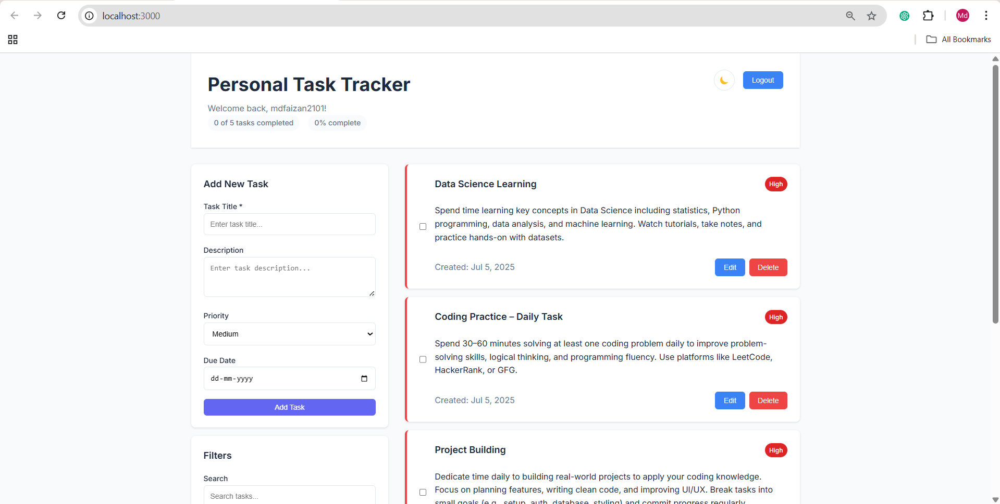
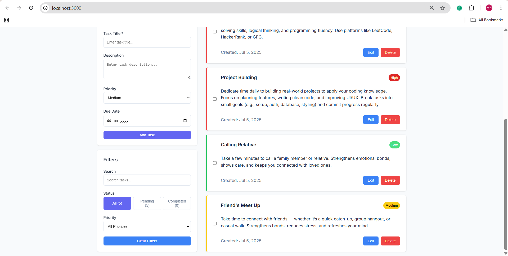
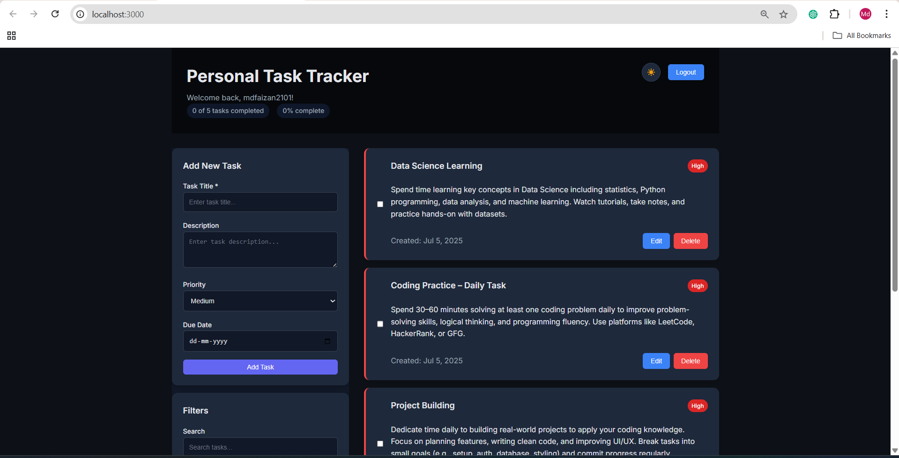
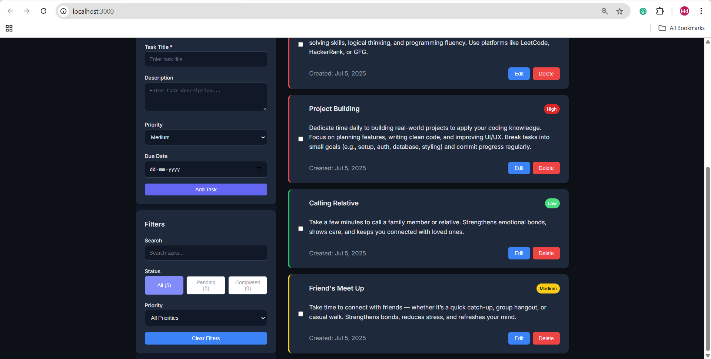

# Personal Task Tracker

## Description

A modern, feature-rich personal task tracker built with React and TypeScript. Organize your life with ease using this beautiful and intuitive task management application. Perfect for individuals who want to stay organized with a clean, user-friendly interface.

## Features

- ✅ **Simple Login System** - Username-based authentication with localStorage persistence
- ✅ **Task Management** - Add, edit, delete, and toggle task completion
- ✅ **Task Display** - Show title, description, completion status, and creation date
- ✅ **Task Filtering** - Filter by status (All/Pending/Completed) with real-time counts
- ✅ **Search Functionality** - Real-time search through task titles and descriptions
- ✅ **Task Priority Levels** - High, Medium, Low priorities with color-coded indicators
- ✅ **Due Dates for Tasks** - Date picker with overdue detection and visual alerts
- ✅ **Data Persistence** - All data saved to localStorage, survives page refresh
- ✅ **Dark Mode Toggle** - Beautiful light/dark theme with smooth transitions
- ✅ **Smooth Animations** - Hover effects, transitions, and interactive animations
- ✅ **Responsive Design** - Works perfectly on desktop, tablet, and mobile devices

## Setup Instructions

1. Clone the repository
2. Run `npm install`
3. Run `npm start`
4. Open [http://localhost:3000](http://localhost:3000)

## Technologies Used

- **React.js** - Modern React with functional components and hooks
- **TypeScript** - Type-safe development with interfaces
- **CSS3** - Modern styling with CSS variables and responsive design
- **localStorage** - Client-side data persistence
- **React Hooks** - useState, useEffect for state management

## Live Demo

[Link to deployed application - Coming Soon]

## 📸 Screenshots

### 🔆 Light Mode Dashboard

#### 🖼️ Screenshot 1

#### 🖼️ Screenshot 2

---

### 🌙 Dark Mode Dashboard

#### 🖼️ Screenshot 1

#### 🖼️ Screenshot 2

## Key Features Overview

### 🔐 **Simple Login System**
- Username-based authentication
- localStorage persistence
- Auto-login on return visits
- Clean, welcoming interface

### 📝 **Task Management**
- Add tasks with title, description, priority, and due date
- Edit tasks inline with full form
- Delete tasks with confirmation dialog
- Toggle task completion with visual feedback

### 🎨 **Beautiful UI/UX**
- Modern, clean design with smooth animations
- Light and dark mode with theme toggle
- Responsive design for all devices
- Color-coded priority indicators

### 🔍 **Smart Filtering & Search**
- Real-time search through task content
- Filter by status (All/Pending/Completed) with counts
- Filter by priority level
- Clear filters with one click

### 💾 **Data Persistence**
- All data saved to localStorage
- Survives page refresh and browser restart
- No server required - works completely offline
- Automatic saving on every change

### ⚡ **Performance & Accessibility**
- Fast, responsive interface
- Keyboard navigation support
- Screen reader friendly
- Smooth transitions and animations

---

**Built with ❤️ using React and TypeScript** 
